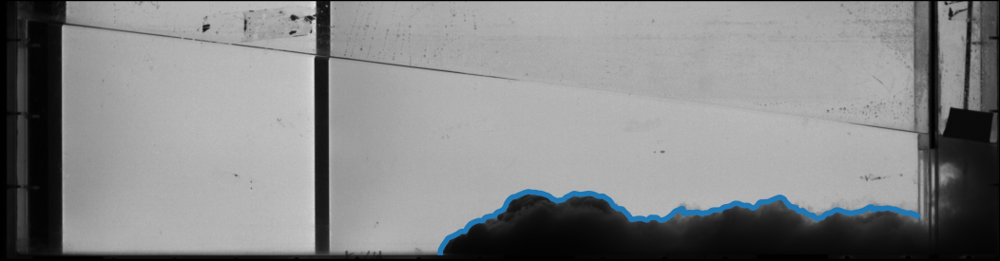

# Slumping regime in lock-release turbidity currents: Bottom slope and particle settling

This repository contains the presentation given at the Euromech608: Dynamics of gravity currents at Grenoble (France) the 20/06/2023 by myself (C. Gadal).

It can be found online [here](https://cgadal.github.io/Talk_Euromech608_gravitycurrents/talk.html#/title-slide). 

It briefly presents the results of the paper:

 - [Gadal, C., Mercier, M., & Lacaze, L. (2022). Slumping regime in lock-release turbidity currents. arXiv preprint arXiv:2301.00192.](https://arxiv.org/abs/2301.00192) (in review at Journal of Fluid Mechanics)

